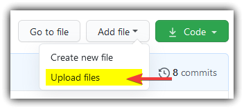

# Guide to the Repository

Because the Blender files are available online, this is the place for renders that I've approved to keep collected in one place. If the render isn't here, then someone hasn't made a pull request for it to be available for the community to use or is simply not a community-produced image.

You may be viewing it, but if not, there is a downloadable PDF that contains this information that you may choose to view instead of the page on Github. Feel free to download it [here](Guide.pdf).

## Using the repository

The preferred way to utilize the repository is to create an issue or the make a pull request. I will see those notifications and typically grant access so long as the files are not disturbing, disgusting, disgraceful or in poor taste.

## Open the Site

First, visit the [Github Repository](https://github.com/GeekOfWires-V/VIPBlenderLogo/).

This page is available to the public. My VIP Github account is GeekOfWires-V and is currently owner of/hosting the Github repostiry. For the sake of this guide, I'll be accessing using my personal account, GeekOfWires, which is a separate account and has not been granted any special privileges.

## Adding Changes

When trying to upload a file, look for the Add File button, that can be found at the top of the repository page just under the repository header section.

### Create Subdirectory

When pressing this button, a drop down will reveal "Create new file" and "Upload files". If you have not created a directory yet, select Create new file and name it YOURNAME/README.md. This will create a new directory with yourname and place a blank readme inside it. Name the branch "YOURNAME-derivatives". Propose the new file, and then afterwards, just click Create pull request.

If you have already done this, select YOURNAME-derivatives branch:

### Upload Files

Move to that created directory and select  Upload files.

## Getting Contributor Access

When uploading, you need contributor access. If you don't have it, you'll see this page:

If you're in a leadership position or well known member in the community, you have a right to contributor access. Ask GeekOfWires#4782 on Discord for contributor access, or fork it, commit to your fork, and then make a pull request to merge it into the master/personal derivatives branch. You can ping me in #public-chat or #vip-social.

After being invited, go to your Github notifications in the top right to visit the notification page.

Click on the notification to bring up the page to accept the invitation.

Now you can proceed with publishing your changes to the repository.

Make sure when you upload, you have:

- Moved to the correct directory
- Moved to the correct branch
- When your branch has changes that you feel satisfied with, make a pull request so that your branch can be shifted into the master or main derivatives branch.

**The longest part of this process is the initial setup. If you believe that this is too extraneous, please send/message the files that will be added to the repository to GeekOfWires so that the changes can be previewed by the rest of the community. Contributions that you have made will be noted in the appropriate directory's/directories' README file that is displayed in the directory as well as the commit that is pushed to the repository.**

